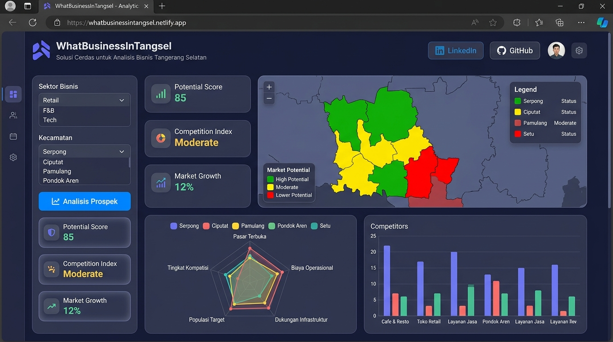

# 🗺️ WhatBusinessInTangsel

> **Business Prospect Analytics Dashboard** — Analisis kelayakan lokasi bisnis interaktif di Kota Tangerang Selatan berdasarkan data nyata BPS & OpenStreetMap.



[](https://whatbusinessintangsel.netlify.app)
[](https://www.linkedin.com/in/cantikaputri-febrianti/)
[](https://nextjs.org/)

---

## 📌 Tentang Proyek

**WhatBusinessInTangsel** adalah portofolio *Business Intelligence* interaktif yang membantu calon pengusaha dan analis untuk:

- 📍 **Mengidentifikasi lokasi terbaik** untuk membuka usaha di 7 kecamatan Tangerang Selatan
- 📊 **Membandingkan potensi bisnis** antar wilayah secara visual
- 🧮 **Mendapatkan skor prospek terbobot** berbasis 8 metrik data nyata
- 🗺️ **Mengeksplorasi peta choropleth interaktif** dengan overlay data demografis dan kompetitor

Proyek ini dibangun sebagai **portofolio Business Analyst** yang menampilkan kemampuan dalam data acquisition, spatial analysis, dan data-driven decision making.

---

## ✨ Fitur Utama

| Fitur | Deskripsi |
|-------|-----------|
| 🗺️ **Peta Interaktif** | Choropleth map berbasis Leaflet.js dengan klik-untuk-analisis per kecamatan |
| 🧮 **Scoring Engine** | Algoritma *weighted scoring* 8 metrik — demografi, kompetitor, aksesibilitas, daya beli |
| 📊 **Visualisasi Multi-Chart** | Radar chart komparasi, bar chart kompetitor, pie chart distribusi sektor |
| ⚖️ **Perbandingan Wilayah** | Tambahkan hingga 4 kecamatan ke mode side-by-side comparison |
| 🌙 **Dark Mode** | Toggle tema gelap/terang dengan persistensi localStorage |
| 📥 **Ekspor Data** | Unduh dataset penduduk dalam format CSV |
| 📱 **Responsive Design** | Berfungsi optimal di desktop, tablet, dan mobile |

---

## 🧠 Metodologi & Data

### Sumber Data
| Data | Sumber | Keterangan |
|------|--------|------------|
| Demografi & Populasi | [BPS Tangerang Selatan](https://tangselkota.bps.go.id/) | Data sensus 2023 |
| Jumlah Kompetitor (POI) | [OpenStreetMap / Overpass API](https://overpass-turbo.eu/) | Tag: `amenity=cafe`, `shop=clothes`, dll. |
| Batas Administrasi | OpenStreetMap GeoJSON | 7 kecamatan Tangsel |

### Weighted Scoring Formula
Skor prospek dihitung menggunakan 8 metrik terbobot:

```
Skor Prospek =
  (Kepadatan Penduduk     × 0.20) +
  (Rasio Kompetitor       × 0.20) +
  (Demografi Anak Muda    × 0.15) +
  (Daya Beli / PDRB       × 0.15) +
  (Aksesibilitas Traffic  × 0.10) +
  (Biaya Sewa Properti    × 0.10) +
  (Anchor POI / Transit   × 0.05) +
  (Tren Pertumbuhan Hist. × 0.05)
```

---

## 🏗️ Tech Stack

```
Frontend   : Next.js 14 (App Router) + TypeScript + React
Peta       : Leaflet.js + React-Leaflet
Charts     : Chart.js + React Chart.js 2
Icons      : Lucide React
Styling    : Tailwind CSS
Deploy     : Netlify (dengan @netlify/plugin-nextjs)
Data       : BPS CSV + OpenStreetMap GeoJSON
```

---

## 🚀 Menjalankan Secara Lokal

```bash
# Clone repository
git clone https://github.com/cantikapf/tangsel-bisnis-v2.git
cd tangsel-bisnis-v2

# Install dependencies
npm install

# Jalankan development server
npm run dev
```

Buka [http://localhost:3000](http://localhost:3000) di browser.

---

## 📂 Struktur Proyek

```
tangsel-bisnis-v2/
├── src/
│   ├── app/
│   │   └── page.tsx          # Main dashboard page
│   ├── components/
│   │   ├── FilterForm.tsx     # Sektor & kecamatan selector
│   │   ├── MapComponent.tsx   # Leaflet choropleth map
│   │   ├── AnalyticsPanel.tsx # Score results & recommendations
│   │   ├── ChartsPanel.tsx    # Radar, bar, pie charts
│   │   ├── ComparisonPanel.tsx# Side-by-side comparison table
│   │   └── Footer.tsx         # Metodologi & author info
│   ├── lib/
│   │   └── engine/
│   │       ├── scoring.ts     # Weighted scoring algorithm
│   │       └── recommender.ts # Recommendation generator
│   └── data/
│       ├── geojson/           # Batas kecamatan GeoJSON
│       └── biMetrics.json     # Dataset untuk Tableau Public
├── public/
│   └── dataset_penduduk_tangsel.csv
├── docs/
│   └── dashboard-preview.jpg
└── netlify.toml
```

---

## 👤 Author

**Cantikaputri Febrianti** — Business Analyst

Proyek ini menampilkan kemampuan dalam:
- **Data Acquisition** — scraping POI via Overpass API, pengolahan data BPS
- **Spatial Analysis** — analisis berbasis lokasi dengan GeoJSON & choropleth mapping
- **Business Intelligence** — weighted scoring model, komparasi multi-metrik
- **Data Visualization** — dashboard interaktif dengan peta, radar chart, dan bar chart
- **Full-Stack Development** — Next.js, TypeScript, Leaflet, Chart.js

[](https://www.linkedin.com/in/cantikaputri-febrianti/)

---

*Data BPS 2023 · OpenStreetMap Contributors · © 2026 Cantikaputri Febrianti*
